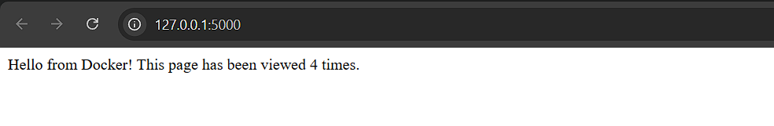

# Практичне заняття: Робота з Dockerfile та Docker Compose

### Опис
Цей проєкт демонструє створення багатосервісного застосунку (Flask + Redis), який запускається за допомогою Docker Compose.

### Скріншот сайту: 

### Висновки
Під час виконання практичної роботи було успішно досягнуто поставленої мети - опанування навичок роботи з директивами Dockerfile та запуску багатосервісних застосунків за допомогою Docker Compose. У ході виконання завдання було створено та налаштовано Docker-образ для веб-застосунку на базі Python та Flask, а також організовано його взаємодію з базою даних Redis у єдиній мережі.

Завдяки використанню Docker Compose вдалося автоматизувати розгортання двох взаємозалежних сервісів, налаштувати прокидання портів та змінні середовища без необхідності ручного запуску кожного контейнера окремо. Результатом роботи є повністю функціональний веб-застосунок із лічильником відвідувань, який коректно зберігає дані про кількість переглядів у базі Redis, що демонструє переваги контейнеризації для ізоляції та швидкого розгортання програмного забезпечення.
